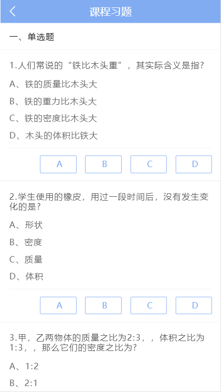
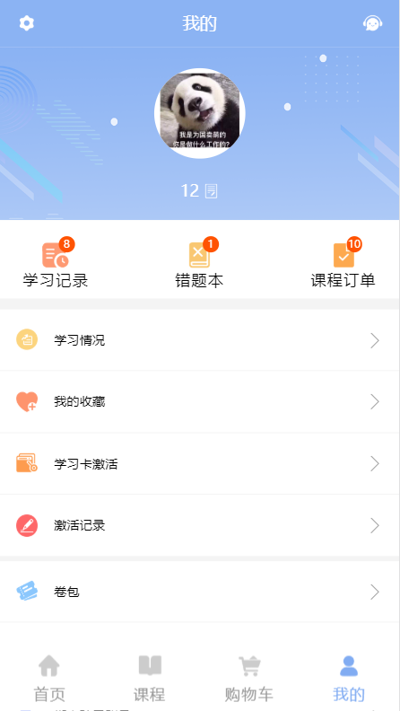
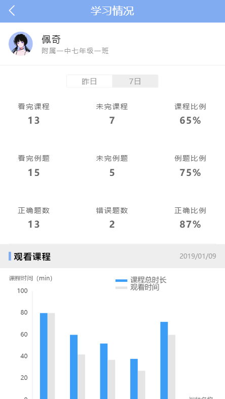

# hippocampus-class

> koa-mongodb-vue 仿作海马课堂app  


# 项目说明

 前端采用MintUI制作页面，登陆采用mongodb数据库保存用户信息，jsonwebtoken进行身份认证，主要是验证token。本地模拟数据，后续会加一些奇奇怪怪的东西，  详细内容请clone项目自己查看


# 项目页面展示

`首页/课程列表`


`购物车/确认订单`


`课程习题/个人中心/学习状态`







## Build Setup

``` bash
# install dependencies
npm install

# serve with hot reload at localhost:8080
npm run dev

# 启动mongodb服务

# 启动node server 服务

node server

# build for production with minification
npm run build

# build for production and view the bundle analyzer report
npm run build --report
```

For a detailed explanation on how things work, check out the [guide](http://vuejs-templates.github.io/webpack/) and [docs for vue-loader](http://vuejs.github.io/vue-loader).
